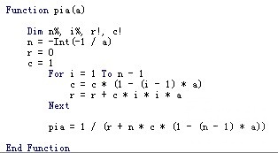
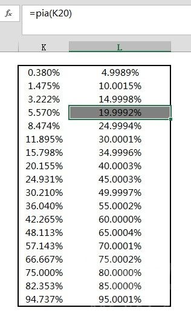

# 伪随机算法 Pseudo Random Distribution

## PRD

> https://dota2.fandom.com/wiki/Random_distribution

这是伪随机在游戏中最常见的用法，因此直接就被玩家用Pseudo Random Distribution的缩写PRD来指代了
其中最为典型的案例就是WAR3，以及用WAR3编辑器制作的DOTA。

在WAR3中，一个暴击率20%的英雄，并不是每一刀都20%暴击率的。
而是以5.57%作为初始暴率，如果第一刀不暴，则第二刀的暴率增加到初始值的2倍：11.14%;
如果还是不暴，就继续增加到初始值的3倍：16.71%，以此类推。
而如果在这个过程中任何一次攻击打出了暴击，就会把暴击率重置到5.57%。

通过验算可以看到，暴雪以这种方式实现的暴击，最终表现出来的暴率仍然是20%。

不过通常来说，PRD并不会在游戏中做实时的概率推算——做这样的逆运算会消耗太多的计算资源。
据我推测，暴雪应该也是建立了一张lookup对照表，在游戏中根据理论暴率查表然后获得动态暴率的基础值。

### 算法

P(N) = C * N

N表示当前攻击的次数，P(N)表示当前攻击的暴击率，C为概率增量。如果我们这次攻击产生了暴击，则需要将 N 重置为 1，如果这次攻击没有产生暴击，则 N + 1。

最后我们再来讨论一下这个 PRD 中的 C 是怎么来的。

在搞清C的由来之前，我们需要确定 N 是什么。

现在我们知道，在玩家暴击后，N 会被重置为 1。 且如果经历了连续不暴击的情况，那么在连续不暴击一定次数后，一定是会产生暴击的。

我们设 最大的连续不暴击次数为 Nmax。那么这个 Nmax 是多少呢？

Nmax = ceil(1 / C) 其中 ceil 是向上取整的意思

> 注意： 一定要明确 Nmax = ceil(1 / C) 而不是 Nmax = ceil(1 / P) 仍是以暴击率为 0.5
> 举例，如果按照 Nmax = ceil(1 / P) 计算： Nmax = ceil(1 / 0.5) = ceil( 2 ) =
> 2，也就是第二次攻击必定暴击，那么可以轻易得出此时 C = P = 0.5 有：P(N) = 0.5 * N
> 这样确实可以保障我们两次攻击中会有一次暴击，避免了连续不出现暴击的情况。 但是其暴击率增量 0.5 等于我们当前的 暴击率 0.5，即 C
> = P，这会导致我仍有很大的可能性出现连续暴击的情况，所以 Nmax = (1 / P) 的计算方式 可以避免连续不出现暴击，但是不能避免连续出现暴击，且会降低游戏的随机性。我们希望的是 C < P 根据上述关于 Nmax 为何是
> ceil(1 / C) 而不是 ceil(1 / P) 的讨论，我们可以发现，C 一定是一个 0~P 范围的数值。0~P
> 范围是一个连续递增的序列，那么在其中要找到一个合适的 C 值，我们就可以使用二分法的方式，来进行查找。

对于C的计算是通过二分法来进行拟合，所以计算过程会很慢，这里使用多线程来计算，并将最终结果输出为 XML 文件进行保存，以便在计算暴击率时，能够直接通过读取配置文件获取 C 值 而无需重新计算 C 值。

### 计算C值

>  https://blog.csdn.net/qq_44857648/article/details/108392612